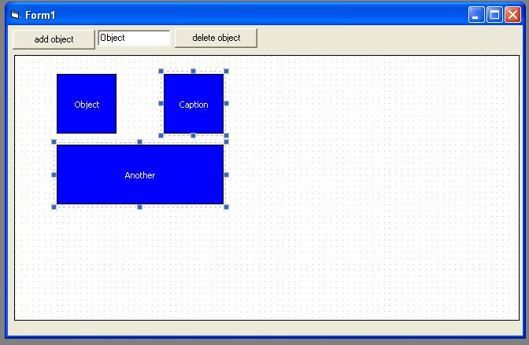



## layout editor

### Description

This VB6 program is a layout editor like .net form editor. You can adding, moving and resizing the objects on layout. There is an activex version too. You can create additional properties to objects.
 
### More Info
 

             |
---                |---
**Submitted On**   |2010-10-06 15:45:18
**By**             |[ferke1107](https://github.com/Planet-Source-Code/PSCIndex/blob/master/ByAuthor/ferke1107.md)
**Level**          |Advanced
**User Rating**    |5.0 (15 globes from 3 users)
**Compatibility**  |VB 4\.0 \(32\-bit\), VB 5\.0, VB 6\.0
**Category**       |[Graphics](https://github.com/Planet-Source-Code/PSCIndex/blob/master/ByCategory/graphics__1-46.md)
**World**          |[Visual Basic](https://github.com/Planet-Source-Code/PSCIndex/blob/master/ByWorld/visual-basic.md)
**Archive File**   |[layout\_edi2190121072010\.zip](https://github.com/Planet-Source-Code/ferke1107-layout-editor__1-73509/archive/master.zip)

